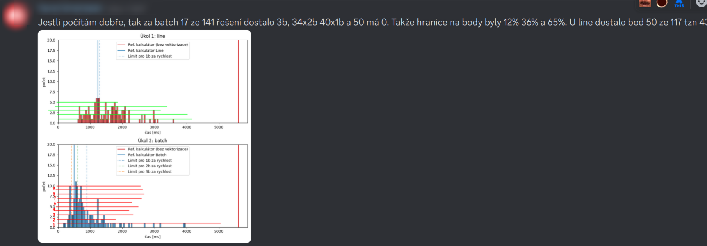

# EVAL
```text
================================================================================
## Vektorizace po radcich
+1.00 b: spravnost vystupu: (error = 0.014%) (max 1 b)
+1.00 b: cas 335 ms do limitu 1300 ms (a spravny vystup) (max 1 b)
Reseni se umistilo mezi 0.00% nejrychlejsimi resenimi


## Vektorizace po blocich
+1.00 b: spravnost vystupu: (error = 0.014%) (max 1 b)
+1.00 b: cas 335 ms do limitu 420 ms (a spravny vystup) (max 1 b)
+1.00 b: cas 335 ms do limitu 620 ms (a spravny vystup) (max 1 b)
+1.00 b: cas 335 ms do limitu 900 ms (a spravny vystup) (max 1 b)
Reseni se umistilo mezi 2.74% nejrychlejsimi resenimi

## Odpovedi, implementace a grafy
+0.50 b: Analyza v Intel Advisor (Q1) (max 0.5 b)
+0.50 b: Pristup k datum (Q2) (max 1 b)
+1.00 b: Roofline a AI (Q3) (max 1 b)
+0.00 b: Vliv velikosti cache (Q4) (max 1 b)
+0.50 b: Vliv symetrie na vykonnost (Q5) (max 0.5 b)
+0.00 b: Graf evaluace (max 0 b)
-1.00 b: bonus (max -1.0 b)
Celkem ziskano: 7.5 bodu

Komentar
================================================================================
Line implementace nedodrzuje zadani - smycky nebyly prohozeny, reseni se chova jako batch (-2)
5. nejrychlejsi implementace batch. (+1)
```

## Comment
- Nesouhlasím s hodnocením -2 za nedodržení zadání
-  

## Kolik lidí dostane body



**Detailnější hodnocení projektu (poskytnuto po odevzdání) je v souboru `AVS_Projekt.pdf`**
