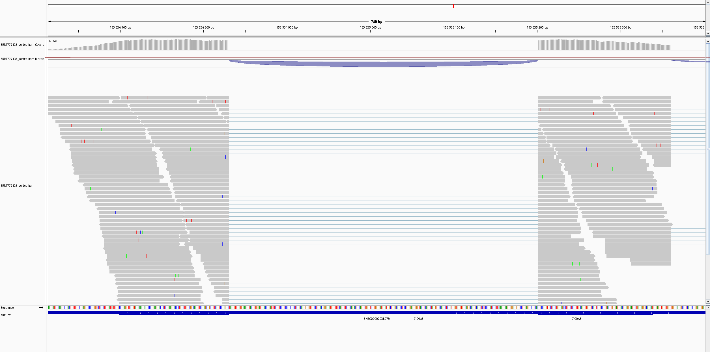

1) From here I downloaded the [SRR1777136](https://trace.ncbi.nlm.nih.gov/Traces/index.html?view=run_browser&acc=SRR1777136&display=download)

2) For some reason, the GTF file from [here](https://genome.ucsc.edu/cgi-bin/hgTables?token=0.3gieRhHX2bFm9uPMIgoXqCEbUGO8jnAHBBXUdPytjeBhMZVFfn1m10NEVgcC5FafqNL9dKPlOQebaMbc_Bye1JLjfONnR-2bUOHxfT9Z9n7WZECTCOzxUmj678TI4DEl_JQs99mfMac40X04sm7PcRwGE6f2Bw91kBHQx68KIeyTLfm3bqNCaT88ChLczYCmSjAyNJpkrCavhRhVrm0WTK7AxvoyXtQ4_5WPzaVGvzG1rHoFsUMC8NxpUQThNVQSFh6af0hZWrWhcbh-gZrdCAORbIGzR_HcLreA-SLrKfHR6I5I2P-_pUOPmaeXfH8xW4nwWPyAiN9b_NFPxJ9OxOU4giBly_IdWfUJAh1ixFiZw3fdXOowCm8Neqr2H6T8jQQ0fJIDaGx5TN87bhMaVPiCnitLEmrMMsr1xmfB65XScvpbhpu1PUpddXrOLyu-1F221Teiq54LrnU0b3tUTFok0hoAVH8NtTV7g0EH2QrT34AS5xshH2Kq-ZXPilvbrtzvF10dQF6bCexBT9TXPMC1yGtIOrFwvTxrK68E0Bp5OC3-cncM_rhQUhm6rOeWSHHwAYBFXoGb_GtwA6YyqYwo-K_wDZG8qoxMyv08OlHIP0gEXIQPO0f1jslNX2aw8ubs55ec4eN7jqJemiTbgomn76gPjBqoJjlMVE1JC9seRd6pPy9FPSzZKKMTNORJ7SyZn0i36MIr2JhWRlkoAl3tVDripMjGCA-a_bFPkVssPpIL2hSwvqUhiwbMJgrlw5SPuEQz0N0PqGypMarmw6zxm4cgKpNECumtkN_vCs1SaTvUpzUcO9cPckRfDCVLwEb7FVE558rhZtw0XnsjQ29prcrWc45gXCIobZwML_U.kaawQgUYsWskKS5XX0WMSw.f9feb13055334f95b96997a19223464cf197625fc0315c633d0d1262dd0a4f2f) was not working as well as the one from here (ftp://ftp.ebi.ac.uk/pub/databases/gencode/Gencode_human/release_49/gencode.v49.annotation.gtf.gz), so I used that one instead.

3) IGV Splicing Visualization:
```bash 
hisat2-build chr1.fa chr1_index
hisat2 -x chr1_index -U SRR1777136.fastq.gz | samtools sort -o SRR1777136_sorted.bam
samtools index SRR1777136_sorted.bam
```

4) The SRR1777136_sorted.bam and chr1.gtf files were loaded into IGV. The resulting Sashimi plot confirms splicing across a large intron, validated by the gene annotation.


5) For computing the normalized expression, I used these commands:
```bash
htseq-count \
-f bam \
-s no \
--idattr=gene_id \
SRX856828_sorted.bam \
S100A_anotace.gtf > counts.txt

# For the amount of mapped reads
samtools flagstat SRX856828_sorted.bam > flagstat_res.txt
```

6) Then I read how many total mapped reads were obtained, which I set in the `calc_tpm.py` script that produces a TSV file with TPM values.

Expiration:

| Gene     | Raw_Count | TPM      |
|----------|-----------|----------|
| S100A1   | 0         | 0.0000   |
| S100A10  | 1485      | 333.1259 |
| S100A11  | 1849      | 906.5032 |
| S100A12  | 0         | 0.0000   |
| S100A13  | 0         | 0.0000   |
| S100A14  | 0         | 0.0000   |
| S100A15A | 0         | 0.0000   |
| S100A16  | 0         | 0.0000   |
| S100A2   | 0         | 0.0000   |
| S100A3   | 0         | 0.0000   |
| S100A4   | 0         | 0.0000   |
| S100A5   | 0         | 0.0000   |
| S100A6   | 162       | 20.2660  |
| S100A7   | 0         | 0.0000   |
| S100A7A  | 0         | 0.0000   |
| S100A7L2 | 0         | 0.0000   |
| S100A7P1 | 0         | 0.0000   |
| S100A8   | 0         | 0.0000   |
| S100A9   | 0         | 0.0000   |
