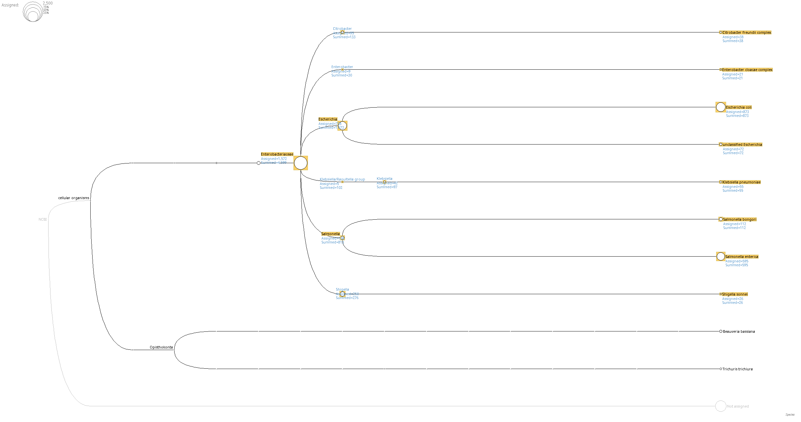

# Vypracování úkolu do PBI - 3. úkol

Autor: Jakub Vlk (xvlkja07)

1) Stáhl jsem si sekvence E. coli a Salmonella z NCBI ve formátu FASTQ (soubory se stahují s kompresí). Odkazy byly v zadání.

2) Spočítal jsem, kolik readů potřebuji pro 4× pokrytí E. coli a 12× pokrytí Salmonella. Velikost genomu E. coli je cca 4,6 Mbp a Salmonella cca 4,8 Mbp.

Pro výpočet průměrné délky readů jsem použil nástroj fastqc. Z reportu vygenerovaného pro oba soubory lze zjistit počet bází a počet sekvencí.

```bash
fastqc salmonella.fastq.gz
fastqc ecoli.fastq.gz
```

Pomocí podílu celkového počtu sekvencí a počtu bází jsem zjistil průměrnou délku readů:

| Název souboru       | Počet bází | Počet sekvencí |
|---------------------|------------|----------------|
| salmonella.fastq.gz | 377,2 Mbp  | 1 583 486      |
| ecoli.fastq.gz      | 438,6 Mbp  | 1 839 408      |

$$
\text{Průměrná délka Salmonella} = \frac{377{,}2 \times 10^6}{1\,583\,486} \approx \mathbf{238 \text{ bp}}; \quad \text{Průměrná délka E. coli} = \frac{438{,}6 \times 10^6}{1\,839\,408} \approx \mathbf{238 \text{ bp}}
$$

3) Spočítal jsem, kolik readů potřebuji pro 4× pokrytí E. coli a 12× pokrytí Salmonella. Velikost genomu E. coli je cca 4,6 Mbp a Salmonella cca 4,8 Mbp. Délka readů je 238 bp.
    * Pro *E. coli* ($\texttt{4}\times$): $\frac{4{,}6 \times 10^6 \times \texttt{4}}{238} \approx 77\,311$.
    * Pro *Salmonella* ($\texttt{12}\times$): $\frac{4{,}8 \times 10^6 \times \texttt{12}}{238} \approx 242\,017$.

4) Provedl jsem subsampling pomocí nástroje seqtk:

```bash
seqtk sample -s100 ecoli.fastq.gz 77311 > ecoli_4x.fastq
seqtk sample -s100 salmonella.fastq.gz 242017 > salmonella_12x.fastq
```

5) Sloučil jsem oba soubory do jednoho:

```bash
cat ecoli_4x.fastq salmonella_12x.fastq > metagenome_input.fastq
```

6) Subsampling a vytvoření assembly jsem provedl příkazy:

```bash
velveth output_dir 31 -fastq -short metagenome_input.fastq
velvetg output_dir -exp_cov auto -cov_cutoff auto
```

7) Pro zrychlení procesu, především stahování databáze a její indexování, jsem využil server hedron.

```bash
diamond blastx -d /mnt/nas/biodata/nr.dmnd -q output_dir/contigs.fa -o mix_contigs_nr.daa -f 100 --long-reads --threads 8 -b 4.0 &
```

Tento příkaz vytvoří soubor `daa`, který jsem pro odevzdání převedl na `m8`. To jsem provedl příkazem:
`diamond view -a mix_contigs_nr.daa -o matches.m8`

8) Soubor `daa` jsem importoval do `MEGAN`. Pro taxonomické soubory jsem použil ten, který je dostupný ze stránek, odkud se instaloval MEGAN6 [zde](https://software-ab.cs.uni-tuebingen.de/download/megan6/welcome.html).


- Poměr byl 595:873, což je zhruba 2:3, což je trochu jiné než by se dalo očekávat ale není to zas tak daleko. 
  
